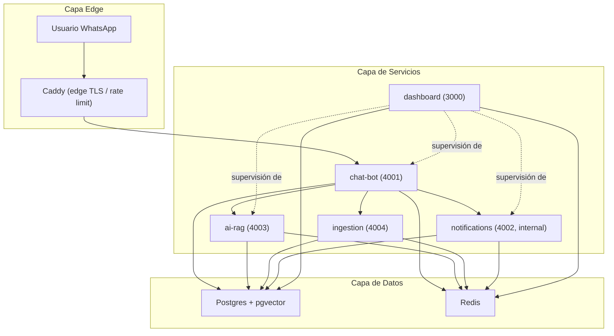

# Arquitectura del Sistema — Chat Asistente Psicológico

Diagrama de componentes por capa: Edge (entrada/proxy), Servicios (aplicaciones) y Datos (almacenamiento).

notifications es internal-only: no tiene ruta pública en Caddy. dashboard supervisa chat-bot, ai-rag y notifications vía Socket.io / API interna.
