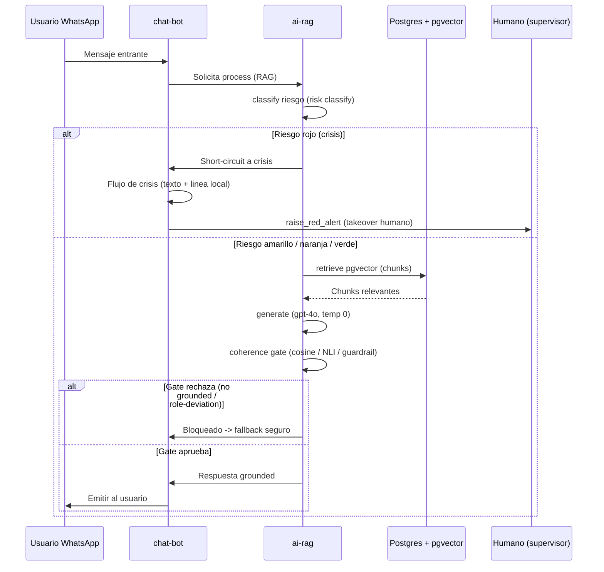
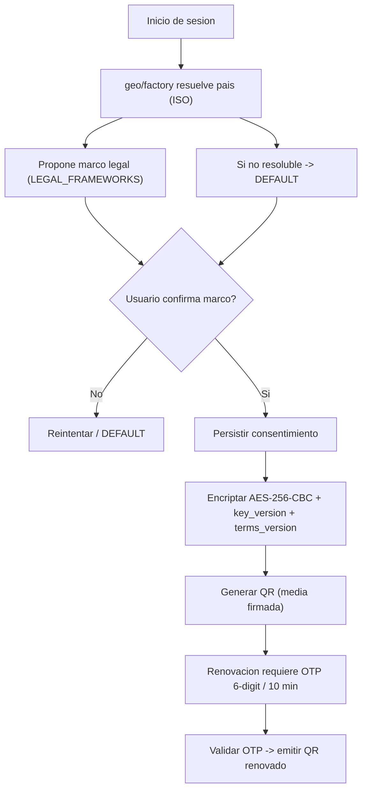
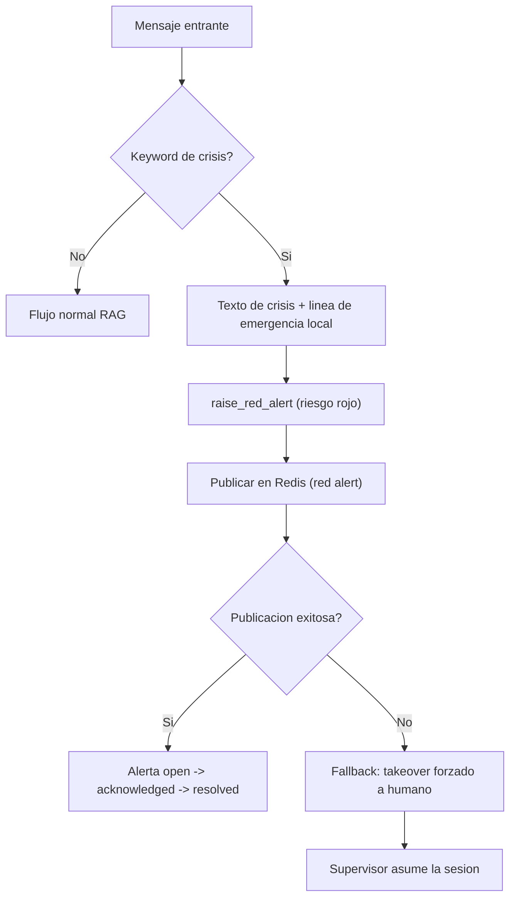

# Flujos de Datos — Chat Asistente Psicológico

Tres diagramas: consulta RAG con rama de crisis, flujo de consentimiento y escalado de crisis.

## (a) Consulta RAG y rama de crisis

Secuencia de una consulta del usuario: clasificación de riesgo, recuperación de pgvector, generación y coherence gate antes de emitir.

## (b) Flujo de consentimiento

Resolución de jurisdicción, propuesta de marco legal, confirmación explícita y persistencia encriptada.

## (c) Escalado de crisis

Detección de keyword, texto de crisis, alerta roja y fallback a toma de control humano.

