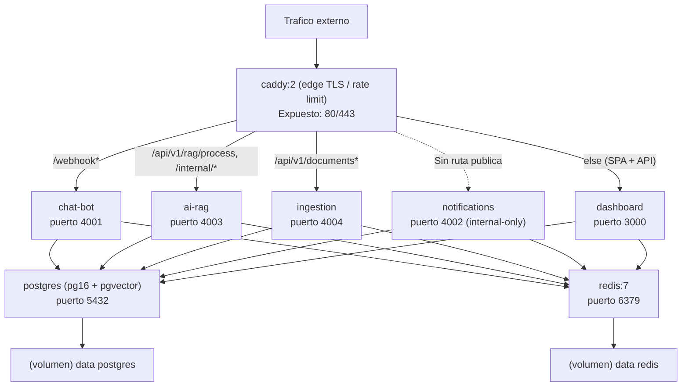

# Despliegue — Topología docker-compose

Contenedores, puertos expuestos y enrutamiento en el edge. notifications es internal-only.

## Notas de despliegue

- `Caddyfile` enruta por prefijo: `/webhook*` a chat-bot, `/api/v1/rag/process` y `/internal/*` a ai-rag, `/api/v1/documents*` a ingestion, el resto a dashboard.
- `notifications` no tiene ruta pública en Caddy (internal-only); recibe alertas vía Redis pub-sub y Socket.io interno.
- Rate limit edge por IP (100 req / 10s); `/healthz` y `/readyz` exentos.
- Imágenes construidas desde `apps/<app>/Dockerfile` (multi-stage, pnpm deploy --prod, non-root, tsx).
