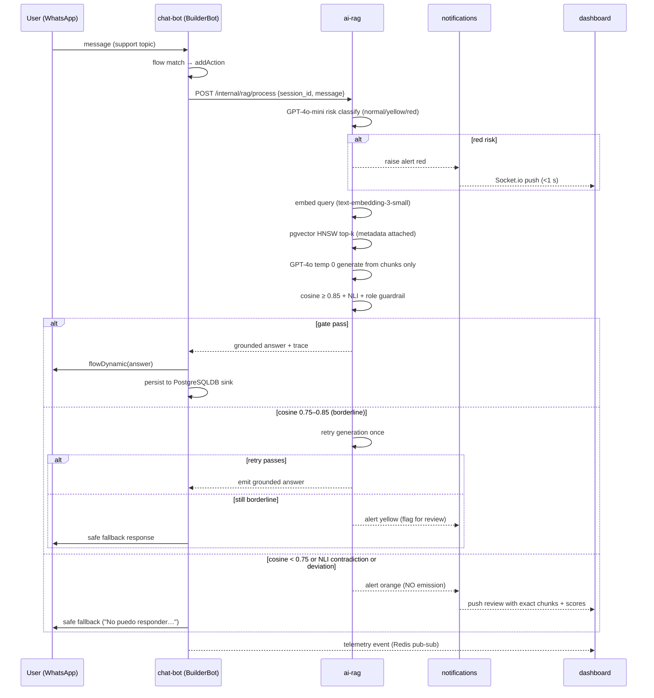
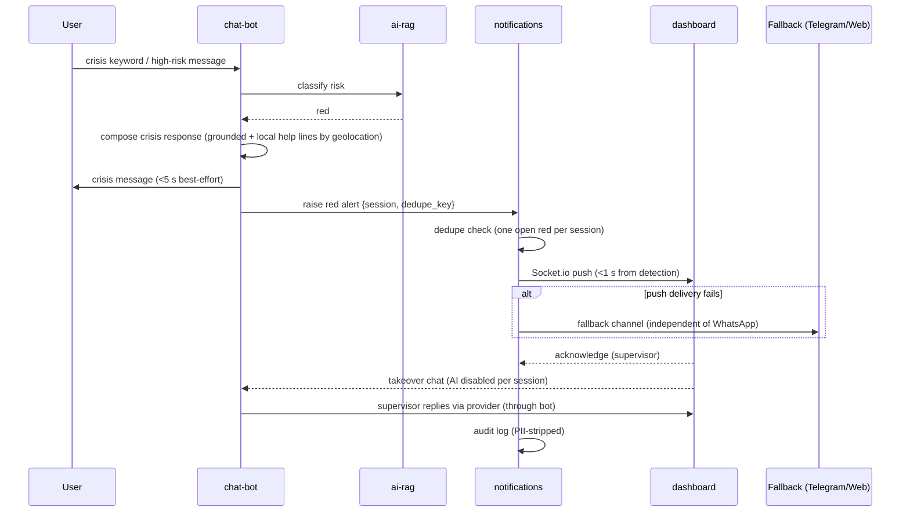

# Design: Chat de Asistencia Psicológica — MVP (WhatsApp)

**Change**: `chat-asistencia-psicologica` | **Project**: `chat-asistente-psicologico` (GREENFIELD)
**Date**: 2026-08-09 | **Status**: Draft — ready for `sdd-tasks`
**Inputs**: `openspec/changes/chat-asistencia-psicologica/proposal.md`, `openspec/specs/*/spec.md` (7 capabilities), `openspec/config.yaml` (design rules: sequence diagrams for complex flows, ADRs with rationale), `exploration.md` (BuilderBot verification).

---

## 1. Technical Approach

A **pnpm monorepo** containing **5 services** (`chat-bot`, `ai-rag`, `dashboard`, `ingestion`, `notifications`) plus **shared packages** (`db-schema`, `crypto-keys`, `validation`, `shared-types`, `llm-client`, `config`, `telemetry`) deployed on **one VPS** via Docker Compose for the pilot, behind a Caddy TLS reverse proxy, over a **single PostgreSQL 16 + pgvector** instance and **Redis 7**.

The safety model is the architecture: every user-facing answer is produced exclusively from curated clinical chunks (RAG-only), generated by GPT-4o at temperature 0, and **never emitted** until the coherence gate (cosine ≥ 0.85 + NLI + role-deviation guardrail) passes. Crisis and deviation signals raise 3-level alerts that reach the supervisor dashboard over Socket.io in < 1s. Health data is AES-256-CBC encrypted at rest under a versioned key scheme with weekly rotation, deferred/forced re-encryption with per-batch rollback, and OTP-gated QR renewal. Anonymous conversations are ephemeral (24–48 h purge); HC-registered histories persist encrypted and exportable.

Maps to the proposal's approach (5 services, shared `crypto-keys` from day one) and satisfies all 7 capability specs: REQ-CHATBOT-1..9, REQ-RAG-1..8, REQ-ALERT-1..6, REQ-DASH-1..9, REQ-CONSENT-1..6, REQ-KEY-1..8, REQ-INGEST-1..6.

---

## 2. Architecture Overview

### 2.1 Monorepo layout

```
chat-asistente-psicologico/
├── pnpm-workspace.yaml
├── package.json                    # root scripts, dev tooling (tsx, eslint, vitest, dotenv)
├── tsconfig.base.json              # strict mode, project references
├── docker-compose.yml              # pilot: 5 services + postgres:16-pgvector + redis:7 + caddy
├── .env.example                    # env schema (no real secrets)
├── openspec/                       # SDD artifacts
├── apps/
│   ├── chat-bot/                   # BuilderBot host: flows, provider, consent, geo, crisis, QR, OTP, purge
│   ├── ai-rag/                     # risk classification, retrieval, generation, validation orchestration
│   ├── dashboard/                  # React 19 + Vite (frontend) + Express 5 + Socket.io (backend)
│   ├── ingestion/                  # blacklist filter, chunking 500–800, embeddings, re-vectorization
│   └── notifications/              # alert routing, dedupe/throttle, push, escalation, fallback channel
└── packages/
    ├── shared-types/               # domain types: Session, Alert, ConsentRecord, KeyVersion, GateResult…
    ├── db-schema/                  # pg + pgvector migrations (node-pg-migrate), repositories, views
    ├── crypto-keys/                # AES-256-CBC + HMAC, key_version, rotation scheduler, re-encryption worker
    ├── validation/                 # coherence gate (cosine), NLI client, role-deviation guardrail, blacklist
    ├── llm-client/                 # OpenAI wrapper: gpt-4o (temp 0), gpt-4o-mini, text-embedding-3-small
    ├── config/                     # zod env schema + secrets loading (KeyProvider abstraction)
    └── telemetry/                  # structured PII-stripped logging + Redis pub-sub event emitter
```

Three packages are **safety-critical** and shared so there is a single source of truth: `db-schema` (data layout incl. encryption-state columns), `crypto-keys` (encryption/rotation/QR/OTP), `validation` (the emission gate). A change to a guardrail policy or a schema migration is atomic across all services.

### 2.2 Service topology

```
                          ┌──────────────────────────────┐
   WhatsApp (Baileys WS) ─▶│ 1. chat-bot                 │
                          │  BuilderBot: flow/provider/db │
                          └──────┬──────────────┬────────┘
                                 │ REST (internal)│ Redis pub-sub + Socket.io
                    ┌────────────▼───┐           └──────────▶┌──────────────────────────┐
                    │ 2. ai-rag      │◀──────────────────────│ 3. dashboard             │
                    │  GPT-4o / mini │   RAG context fetch   │  React19/Vite + Express  │
                    │  pgvector HNSW │                        │  + Socket.io + Recharts  │
                    └───────┬────────┘                        └───────────▲──────────────┘
                            │                                            │ alerts / push
                    ┌───────▼────────┐                           ┌────────┴──────────────┐
                    │ PostgreSQL 16  │                           │ 5. notifications       │
                    │ + pgvector     │◀──────────────────────────│  alert routing/dedupe  │
                    └───────▲────────┘   4. ingestion ─────────▶└────────────────────────┘
                            │              (blacklist/chunk/embed)      (fallback: Telegram/Web)
                    ┌───────┴────────┐
                    │ Redis 7        │  pub/sub, OTP TTL cache, alert queues, session state
                    └────────────────┘
```

- **chat-bot** ↔ **ai-rag**: synchronous REST call inside `addAction` (p95 < 8 s budget for Q&A).
- **ai-rag** → **notifications**: alert events via Redis pub-sub (dedupe/throttle), push to dashboard over Socket.io.
- **dashboard** ↔ **chat-bot**: takeover/supervisor-reply path via internal REST; live chat events via Redis pub-sub → Socket.io.
- **ingestion** → **ai-rag**/DB: writes `documents` + `vector_chunks` directly; triggers re-vectorization jobs.
- **crypto-keys** (package) used by chat-bot (consent/QR/OTP), dashboard (monitor), and a rotation scheduler with a worker thread.

### 2.3 Data flow (user message → grounded answer)

```
U msg → provider 'message' → flow match → addAction
  → POST /internal/rag/process  (ai-rag)
      → GPT-4o-mini risk classify (red/orange/yellow/normal)
      → embed query (text-embedding-3-small) → pgvector HNSW top-k (metadata: category/source/language/framework)
      → GPT-4o temp 0 generate from chunks ONLY
      → coherence gate: cosine ≥ 0.85 + NLI + role guardrail
  → red  → crisis response + alert red (push < 1s)
  → orange → NO emission, alert orange (human review with exact chunks)
  → yellow → retry once → flag; borderline answer gated
  → pass → flowDynamic(answer) → persist (PostgreSQLDB sink) → telemetry → dashboard
```

---

## 3. REST API Design (OpenAPI-ready)

**Conventions**: versioned base path `/api/v1`; resources are plural nouns; JSON bodies; pagination via `?limit=&cursor=` (cursor for feeds, offset for admin lists); RFC 7807 `problem+json` errors; all dashboard/ingestion/notifications endpoints require `Authorization: Bearer <JWT>`; internal service calls use `X-Internal-Token` (env) over the private Docker network. Every request that touches encrypted data or QR/keys is audit-logged server-side.

### 3.1 Endpoint catalog

#### Session & privacy (public — chat flows, no JWT; bound to an ephemeral session token)

| Method | Path | Auth | Description |
|---|---|---|---|
| POST | `/api/v1/sessions/start` | — | Resolve IP → propose jurisdiction; return `session_id` + framework proposal. No data stored before consent. |
| POST | `/api/v1/sessions/{id}/jurisdiction` | session | Confirm/correct jurisdiction (VPN mitigation); returns privacy notice text + `terms_version`. |
| GET | `/api/v1/frameworks` | session | List supported legal frameworks (6 + conservative default). |

#### Consent & QR (chat-triggered; session-bound)

| Method | Path | Auth | Description |
|---|---|---|---|
| POST | `/api/v1/consent` | session | HC checkbox acceptance → AES-256-CBC → Base64 → issue QR payload; creates registry row (terms_version, jurisdiction, key_version, integrity hash). |
| GET | `/api/v1/consent/{id}` | session/admin | Read consent registry metadata (encrypted payload never returned). |
| POST | `/api/v1/consent/{id}/otp/request` | session | Issue 6-digit OTP (10-min TTL, delivered via chat), returns `otp_request_id`. |
| POST | `/api/v1/consent/{id}/otp/verify` | session | Verify OTP → returns `qr_renewal_token` (short-lived). |
| POST | `/api/v1/consent/{id}/qr/renew` | session + token | Re-sign QR with current key_version; archives old signature; returns QR image (Base64 PNG). |
| POST | `/api/v1/consent/{id}/export` | session (HC) | Export decrypted clinical history for the treating professional; server-side decrypt; audit-logged. |

#### Chat message ingestion (webhook bridge)

| Method | Path | Auth | Description |
|---|---|---|---|
| POST | `/api/v1/webhooks/{provider}` | provider-specific (verify token / `X-Hub-Signature-256`) | Provider-independent inbound webhook bridge (Meta WABA later; Baileys uses WS natively). Payload PII is stripped before any log. |
| POST | `/api/v1/messages/ingest` | internal | Internal injection point for supervisor takeover replies (dashboard → chat-bot → provider). |
| POST | `/api/v1/webhooks/{provider}/status` | provider-specific | Delivery status callbacks (Baileys receipts / Meta statuses) — used by reliability monitoring. |

#### Dashboard — chats (supervisor)

| Method | Path | Auth | Description |
|---|---|---|---|
| GET | `/api/v1/dashboard/chats` | supervisor/admin | Paginated chat list (anonymized identifiers only). |
| GET | `/api/v1/dashboard/chats/{id}` | supervisor/admin | Dual-chat view: user/bot messages + RAG trace (chunks, gate scores, alert level). |
| GET | `/api/v1/dashboard/chats/{id}/rag-context` | supervisor/admin | Exact retrieval context for a flagged answer (orange/yellow). |
| POST | `/api/v1/dashboard/chats/{id}/takeover` | supervisor/admin | Enable human takeover (AI disabled per chat). Audit-logged. |
| POST | `/api/v1/dashboard/chats/{id}/release` | supervisor/admin | Release takeover; AI resumes. Audit-logged. |

#### Dashboard — alerts (supervisor/admin)

| Method | Path | Auth | Description |
|---|---|---|---|
| GET | `/api/v1/dashboard/alerts` | supervisor/admin | Live alert feed (level, status, dedupe state); Socket.io mirrors pushes. |
| POST | `/api/v1/dashboard/alerts/{id}/acknowledge` | supervisor/admin | Acknowledge; transitions state; audit-logged. |
| POST | `/api/v1/dashboard/alerts/{id}/resolve` | supervisor/admin | Resolve with reason; audit-logged. |

#### Dashboard — vectors / knowledge base (supervisor/admin)

| Method | Path | Auth | Description |
|---|---|---|---|
| GET | `/api/v1/dashboard/vectors/search?q=&category=&framework=` | supervisor/admin | Vector explorer: semantic + metadata search over chunks. |
| GET | `/api/v1/dashboard/vectors/{id}` | supervisor/admin | Chunk detail incl. all metadata and blacklist status. |
| DELETE | `/api/v1/dashboard/vectors/{id}` | supervisor/admin | Manual chunk removal ("zonas prohibidas" sweep follow-up). Audit-logged. |
| POST | `/api/v1/dashboard/re-vectorization` | admin | Trigger manual re-vectorization of one/all documents. |

#### Dashboard — keys & QR validation (admin; QR validation = supervisor+admin)

| Method | Path | Auth | Description |
|---|---|---|---|
| GET | `/api/v1/dashboard/keys` | admin | Key lifecycle: active/retired/expired, 7-day countdown, forced-clock (12 h). |
| GET | `/api/v1/dashboard/keys/rotation` | admin | Per-batch re-encryption progress (live via Socket.io). |
| POST | `/api/v1/dashboard/keys/rotate` | admin | Manual rotation trigger (dry-run first; audit-logged). |
| POST | `/api/v1/dashboard/qr/validate` | supervisor/admin | QR payload → consent/signature chain verification. Audit-logged. |
| POST | `/api/v1/dashboard/qr/validate/chain` | supervisor/admin | Inspect archived signature chain across rotations. |

#### Dashboard — audit & compliance (admin)

| Method | Path | Auth | Description |
|---|---|---|---|
| GET | `/api/v1/dashboard/audit` | admin | Audit trail: actor, action, resource, timestamp, reason (PII-stripped, paginated). |
| GET | `/api/v1/dashboard/legal-frameworks` | supervisor/admin | Framework list with active terms_version. |
| POST | `/api/v1/dashboard/legal-frameworks` | admin | Publish new notice/terms version per country. |

#### Ingestion (admin; internal worker token for scheduled runs)

| Method | Path | Auth | Description |
|---|---|---|---|
| POST | `/api/v1/ingestion/documents` | admin | Upload document → blacklist filter → chunk → embed → upsert. |
| GET | `/api/v1/ingestion/documents` | admin | Document index with status + blacklist_hits. |
| GET | `/api/v1/ingestion/documents/{id}` | admin | Document detail + per-chunk results. |
| POST | `/api/v1/ingestion/documents/{id}/re-vectorize` | admin | Rebuild affected embeddings (idempotent upsert, stale-row cleanup). |
| GET | `/api/v1/ingestion/jobs/{id}` | admin | Job progress (status, chunks done/total). |

#### Auth & health

| Method | Path | Auth | Description |
|---|---|---|---|
| POST | `/api/v1/auth/login` | — | Env-bootstrapped admin/supervisor credentials → JWT (15-min access). |
| GET | `/api/v1/auth/me` | JWT | Current user + role. |
| GET | `/healthz` `/readyz` | — | Liveness/readiness per service (also used by Caddy/Docker healthchecks). |

### 3.2 Error model (RFC 7807)

```json
{
  "type": "https://api.chatcap.app/errors/coherence-gate-blocked",
  "title": "Output blocked by coherence gate",
  "status": 422,
  "detail": "Generated answer failed grounding (cosine 0.71 < 0.75); no emission occurred.",
  "instance": "/api/v1/dashboard/alerts/alert_9f2c",
  "trace_id": "01J2…",
  "code": "gate_blocked"
}
```

Error `code` values (stable): `validation_error` (400), `unauthorized` (401), `forbidden` (403 — RBAC), `not_found` (404), `conflict` (409 — e.g. takeover already active), `rate_limited` (429), `gate_blocked` (422), `otp_invalid` (422), `otp_expired` (422), `rotation_in_progress` (409), `upstream_failed` (502 — OpenAI/pgvector degraded), `internal_error` (500). Rate limits: dashboard 60 req/min/user; webhook 100 req/min/IP; consent/OTP endpoints 10 req/min/session.

### 3.3 Auth model

- **JWT (HS256, pilot)**: claims `{ sub, role, exp: 15min }`. `ADMIN_EMAIL` + `ADMIN_PASSWORD_HASH` env bootstrap creates the first admin at first boot; supervisors are created by admin (bcrypt hashes). Refresh: sliding 8-h session for the internal tool; no refresh tokens in MVP.
- **Roles**: `anonymous` (chat user, never reaches REST), `patient` (HC-registered; export/renew via chat flows), `supervisor` (chats, alerts, RAG context, takeover, QR validate), `admin` (+ keys, re-vectorization, audit, legal frameworks, users).
- **Middleware chain**: `authenticate` (verify JWT) → `authorize(role)` → optional `audit` (records who/when/why for encrypted-record access). Every denial is audit-logged (REQ-DASH-1).
- **Service-to-service**: `X-Internal-Token` per pair (chat-bot↔ai-rag↔notifications↔dashboard) over the private Docker network; production upgrade path: mTLS.
- **Kill switch**: env `AI_EMISSION_ENABLED=false` disables AI emission globally; per-chat takeover disables it locally. Bot degrades to human-only replies (REQ-CHATBOT-3; proposal rollback).

---

## 4. Data Model (PostgreSQL 16 + pgvector)

Naming: snake_case, plural tables, UUID v7 PKs, `created_at`/`updated_at` everywhere. Encrypted columns are `BYTEA`; every encrypted row carries `key_version` (REQ-KEY-1) and an integrity hash.

```mermaid
erDiagram
    legal_frameworks ||--o{ sessions : governs
    sessions ||--o{ consent_records : "0..1"
    sessions ||--o{ alerts : raises
    consent_records ||--o{ qr_signatures : archives
    key_versions ||--o{ consent_records : "encrypts with"
    documents ||--o{ vector_chunks : chunks
    vector_chunks ||--o{ ingestion_jobs : "processed by"
    users ||--o{ alerts : "acknowledges"
    users ||--o{ audit_logs : performs
    re_encryption_batches }o--|| key_versions : "key_from/key_to"
    otp_codes }o--|| consent_records : "renews"

    legal_frameworks { uuid id PK; text country_code; text framework_code; text notice_text; int terms_version; timestamptz effective_at; bool active }
    sessions { uuid id PK; text contact_key_anon; text jurisdiction; text persistence_class; text consent_state; text ai_state; timestamptz created_at; timestamptz last_activity_at; timestamptz purge_at }
    consent_records { uuid id PK; uuid session_id FK; text jurisdiction; int terms_version; int key_version; bytea encrypted_payload; text integrity_hash; bool active; timestamptz created_at }
    qr_signatures { uuid id PK; uuid consent_id FK; int key_version; text signature; text status; timestamptz created_at }
    key_versions { int key_version PK; text algorithm; text salt; text status; timestamptz created_at; timestamptz expires_at; timestamptz forced_rotation_due_at }
    alerts { uuid id PK; text level; text category; uuid session_id FK; text status; text dedupe_key; uuid acknowledged_by FK; timestamptz created_at; timestamptz resolved_at }
    documents { uuid id PK; text title; text source_url; text source_type; text language; text legal_framework; text status; int blacklist_hits; timestamptz created_at }
    vector_chunks { uuid id PK; uuid doc_id FK; int chunk_index; text content; vector embedding; text category; text source; text language; text legal_framework; timestamptz created_at }
    ingestion_jobs { uuid id PK; text job_type; text status; int chunks_total; int chunks_done; text error; timestamptz created_at }
    users { uuid id PK; text email; text password_hash; text role; timestamptz created_at }
    otp_codes { uuid id PK; uuid consent_id FK; text otp_hash; int attempts; timestamptz expires_at; text status }
    re_encryption_batches { uuid id PK; int key_from; int key_to; text status; int rows_count; text integrity_hash; text error; timestamptz started_at; timestamptz completed_at }
    audit_logs { uuid id PK; text actor_type; uuid actor_id; text action; text resource_type; text resource_id; text reason; jsonb meta; timestamptz created_at }
```

### 4.1 Table notes

- **`sessions`** — `contact_key_anon` = `SHA-256(phone || pepper)` (never the raw phone; REQ-DASH-9). `persistence_class ∈ {anonymous, hc}` (REQ-CONSENT-5); `purge_at = created_at + 24h` for anonymous. `ai_state ∈ {auto, takeover}` drives per-chat AI disable (REQ-DASH-3).
- **`contacts` / `history`** — created by `@builderbot/database-postgres` on first connect (auto-migration: `save_or_update_history_and_contact` atomic upsert). Our migration ADDS columns: `persistence_class`, `key_version`, `purge_at` on `history` for dual-persistence + re-encryption bookkeeping. The BuilderBot adapter owns row writes; `chat-bot` sets the extra columns via repository wrappers.
- **`consent_records`** — payload encrypted AES-256-CBC (`encrypted_payload BYTEA`), `integrity_hash` = HMAC (REQ-CONSENT-4). `key_version` FK-soft to `key_versions`.
- **`key_versions`** — metadata only; key material is DERIVED, never stored (see §6.1). `salt` random per version. `status ∈ {active, retired, expired, compromised}`.
- **`vector_chunks`** — curated clinical content (not user PII) stored plaintext with mandatory metadata (REQ-RAG-3, REQ-INGEST-4). `embedding vector(1536)` (text-embedding-3-small).
- **`alerts`** — `dedupe_key = sha256(level || session_id || category || keyword)` enables one-open-alert semantics (REQ-ALERT-5). Status machine: `open → acknowledged → resolved`.
- **`audit_logs`** — `meta` JSONB holds non-PII detail only (REQ-DASH-8): never message content, never phone, never raw webhook payload.
- **`otp_codes`** — hash-only storage, TTL mirrored in Redis; `attempts` capped (5) with lockout.
- **`re_encryption_batches`** — per-batch integrity hash + status machine (`pending → running → verified | rolled_back`) (REQ-KEY-4).
- **`qr_signatures`** — archived signatures per rotation for the chain of trust (REQ-KEY-7).

### 4.2 pgvector HNSW

```sql
CREATE EXTENSION IF NOT EXISTS vector;
CREATE INDEX idx_vector_chunks_embedding_hnsw
  ON vector_chunks USING hnsw (embedding vector_cosine_ops)
  WITH (m = 16, ef_construction = 64);
```
Retrieval uses cosine distance via the HNSW index with parameterized SQL (REQ-RAG-2); `SET hnsw.ef_search = 40` per query. Startup assertion: fail loudly if the index is missing (never serve silently).

### 4.3 Dashboard-query indexes

```sql
CREATE INDEX idx_alerts_level_status_created ON alerts (level, status, created_at DESC);
CREATE INDEX idx_alerts_session ON alerts (session_id);
CREATE INDEX idx_sessions_state_last_activity ON sessions (ai_state, last_activity_at DESC);
CREATE INDEX idx_sessions_purge ON sessions (purge_at) WHERE persistence_class = 'anonymous';
CREATE INDEX idx_history_session_created ON history (session_id, created_at DESC);
CREATE INDEX idx_history_purge ON history (purge_at) WHERE persistence_class = 'anonymous';
CREATE INDEX idx_vector_chunks_meta ON vector_chunks (category, language, legal_framework, source);
CREATE INDEX idx_audit_actor_created ON audit_logs (actor_id, created_at DESC);
CREATE INDEX idx_batches_status ON re_encryption_batches (status, started_at);
```

### 4.4 Dual persistence (REQ-CONSENT-5, REQ-CHATBOT-9)

- **HC**: `persistence_class='hc'` — rows persist, encrypted, exportable via `POST /consent/{id}/export`.
- **Anonymous**: `persistence_class='anonymous'` — `purge_at` set at creation; purge job (node-cron inside `chat-bot`, plus a DB-backed sweep for missed windows) deletes `history` + related `sessions` rows where `purge_at ≤ NOW()` — MAY begin at +24 h, MUST be complete by +48 h. Purge is a parameterized batched DELETE (100–500 rows) with `audit_logs` entry (no PII). HC rows are untouched (WHERE persistence_class = 'anonymous').

---

## 5. Sequence Diagrams

### 5.1 Anonymous chat + RAG + coherence gate + emission (REQ-CHATBOT-2, REQ-RAG-1..8)



### 5.2 Crisis escalation — red alert (REQ-ALERT-1..6)



### 5.3 Consent → AES-256-CBC → Base64 → QR → OTP-gated renewal (REQ-CONSENT-3/4, REQ-KEY-6/7)

```mermaid
sequenceDiagram
    participant U as User
    participant B as chat-bot
    participant K as crypto-keys
    participant DB as PostgreSQL

    Note over U,B: jurisdiction confirmed; notice shown
    U->>B: HC checkbox consent accepted
    B->>K: encrypt payload (AES-256-CBC, IV, key_version N) + HMAC
    K-->>B: ciphertext + integrity_hash
    B->>DB: INSERT consent_records (terms_version, jurisdiction, key_version, encrypted_payload)
    B->>B: build QR payload {consent_id, terms_version, key_version, iat} + HMAC sig
    B->>B: node-qrcode → Base64 PNG
    B->>U: send QR image in chat (media via addAction)
    Note over U,DB: 7-day rotation → key_version N+1 (new salt)
    U->>B: request renewed QR
    B->>K: generate OTP (6-digit) → hash
    B->>U: deliver OTP via chat (10-min validity)
    U->>B: submit OTP
    B->>B: verify hash + TTL + attempts
    alt OTP valid
        B->>K: re-sign QR with key_version N+1
        B->>U: send new QR image
        B->>DB: archive old signature (qr_signatures)
    else OTP invalid/expired
        B->>U: refusal → fresh OTP issued
    end
```

### 5.4 Re-encryption — deferred / forced (12 h) with batch rollback (REQ-KEY-2..5, REQ-KEY-8)

```mermaid
sequenceDiagram
    participant S as Rotation scheduler (crypto-keys)
    participant W as Worker thread
    participant DB as PostgreSQL
    participant D as dashboard

    S->>S: key N expires → create key N+1 (active, new salt)
    Note over S,W: Deferred phase — low-traffic window
    loop per user: 30-min inactivity or session end
        S->>W: enqueue user's rows (batch 100–500)
        W->>DB: SELECT rows WHERE key_version = N (batch)
        W->>W: decrypt (key N) → re-encrypt (key N+1)
        W->>W: compute batch integrity hash
        W->>DB: BEGIN; UPDATE batch (key_version, ciphertext); COMMIT
        alt integrity hash mismatch
            W->>DB: ROLLBACK batch
            W->>DB: rows remain valid under key N (dual-read)
            W-->>D: batch failed telemetry
        else success
            W-->>D: progress event (Socket.io)
        end
    end
    Note over S,DB: T+12h post-expiry → forced phase
    S->>W: FORCED re-encryption of remaining rows (audit-logged)
    S->>DB: verify 100% migrated
    S->>DB: retire key N (dual-read ends after verification)
```

---

## 6. Security Design

### 6.1 Cryptography (packages/crypto-keys)

- **At rest**: AES-256-CBC (client constraint C10), random 16-byte IV per row, `encrypt-then-MAC` with HMAC-SHA256; stored form `base64(iv || ciphertext || hmac)` in `BYTEA`. Backend-only — crypto never runs on any client (REQ-CONSENT-3).
- **Key derivation (material never stored)**: for `key_version K`, `key_K = HKDF-SHA256(master_secret, salt_K, "chatcap-aes-256-cbc-v1")`; `salt_K` random per version stored in `key_versions`. Master secret from env (`CRYPTO_MASTER_SECRET`) or Vault in production. Old keys remain derivable during transition (dual-read, REQ-KEY-8).
- **Lifecycle (REQ-KEY-1)**: 7-day expiry, forward secrecy; new key active at rotation; `expires_at` + `forced_rotation_due_at = expires_at + 12h`.
- **QR integrity**: payload `{v:1, consent_id, terms_version, key_version, iat}` + `sig = HMAC(QR_KEY, canonical(payload))`; every rotation archives the previous signature (`qr_signatures`) so the chain of trust verifies across rotations (REQ-KEY-7). Tampered/expired QR → validation failure with reason (REQ-DASH-7).
- **OTP**: 6-digit, 10-min TTL, hashed at rest, 5-attempt lockout, fresh-issue on expiry (REQ-KEY-6). Delivered via WhatsApp (Baileys) per proposal assumption 4.

### 6.2 Secrets & key management

- Pilot: env-only (`config` package zod-validates every var at boot; `.env.example` has placeholders, no real secrets; `.env` git-ignored).
- `KeyProvider` interface in `config`: `EnvKeyProvider` (pilot) → `VaultKeyProvider` / `KMSKeyProvider` (production) — swap is config-only (ADR-005).
- AGENTS.md hard rule honored: no hardcoded secrets anywhere in code or committed config.

### 6.3 Transport, RBAC, audit, PII

- **TLS 1.2+** end-to-end: Caddy terminates TLS in front of dashboard + chat-bot webhook surface; internal traffic on the private Docker network.
- **RBAC matrix**:

| Resource | anonymous | patient | supervisor | admin |
|---|---|---|---|---|
| Chat (WhatsApp flows) | ✅ | ✅ | — | — |
| Consent / QR / OTP | ✅ (chat) | ✅ | ✅ (validate only) | ✅ |
| History export | — | ✅ (own) | — | ✅ (audited) |
| Chats + RAG context | — | — | ✅ | ✅ |
| Takeover / alerts | — | — | ✅ | ✅ |
| Key rotation / re-vectorization / audit / legal frameworks | — | — | — | ✅ |

- **Audit logging** (REQ-DASH-8, REQ-ALERT-6): QR validation, key access, takeover/release, forced re-encryption, manual vector removal, consent export, RBAC denials — all `audit_logs` rows with actor/timestamp/reason; **PII-stripped** (no message content, no phones, no raw webhook payloads).
- **PII stripping**: phone → `SHA-256(phone || pepper)` for dashboard; logs through `telemetry` redactor (regex + allowlist for trace IDs); webhook payloads never logged (AGENTS.md rule).
- **Privacy gates**: nothing stored before jurisdiction confirmed + notice accepted (REQ-CONSENT-1/2); unknown jurisdiction → conservative highest-privacy default + legal-review flag (REQ-CONSENT-6).

---

## 7. Infrastructure & Deployment (pilot VPS, Docker Compose)

### 7.1 Services & resources

| Container | Image / base | Purpose |
|---|---|---|
| `chat-bot` | node:22-alpine (built) | BuilderBot + Baileys + REST bridge |
| `ai-rag` | node:22-alpine (built) | Retrieval/generation/gates |
| `dashboard` | node:22-alpine (built) — Vite static served by Express | UI + Socket.io + REST |
| `ingestion` | node:22-alpine (built) | Curation pipeline + scheduler |
| `notifications` | node:22-alpine (built) | Alert routing/push |
| `postgres` | pgvector/pgvector:pg16 | Single DB (relational + vectors) |
| `redis` | redis:7-alpine | Pub/sub, OTP TTL, alert queues, session state |
| `caddy` | caddy:2-alpine | TLS reverse proxy (dashboard + webhooks), automatic Let's Encrypt |

Resource sizing (pilot with headroom): 4 vCPU / 8 GB RAM VPS in LatAm (Colombia/México per proposal assumption 9); Postgres container 2 GB cache; Redis 512 MB maxmemory (allkeys-lru, except OTP keyspace). `restart: unless-stopped`, `healthcheck` on `/healthz` for every app container; depends_on with health gates.

### 7.2 Backups & monitoring

- **Backups**: nightly `pg_dump --format=custom` to a mounted volume + offsite copy (rclone/rsync to object storage); restore point snapshot before each rotation window (proposal rollback). Redis: AOF for OTP/session state (ephemeral loss acceptable — chat history is in Postgres).
- **Monitoring**: structured JSON logs (pino) via `telemetry`, PII-stripped, shipped to stdout (Docker logs); metrics endpoints (`/healthz`, `/readyz` + counters: gate failures, alert SLAs, rotation progress, re-encryption health); dashboard Socket.io channels surface the same telemetry (alert semaphore, key monitor). Prometheus+Grafana are a post-pilot add, not MVP.
- **Alert fallback**: notifications service pushes to Telegram/Web channel if Socket.io delivery fails or WhatsApp is down (REQ-ALERT-4) — escalation never depends on WhatsApp alone.

### 7.3 Scaling path (documented, not executed)

VPS → cloud: per-service containers behind a managed LB; managed Postgres (RDS/Cloud SQL) with pgvector; Vault/KMS for secrets; Redis managed (ElastiCache/Upstash); multi-region only after legal review (data residency). Meta WABA migration gate (ADR-001) is the production prerequisite.

---

## 8. Technology & Language Choices

| Layer | Choice | Rationale |
|---|---|---|
| Language | **TypeScript (strict)** everywhere | One language across 5 services + dashboard; strict mode is a project hard rule (AGENTS.md); discriminated unions for alert levels/consent states; shared types via `shared-types` |
| Runtime | **Node.js 22 LTS** | BuilderBot/OpenAI/`node:crypto` native; worker_threads for re-encryption; long-lived WS connections for Baileys/Socket.io |
| WhatsApp | **BuilderBot** (`@builderbot/bot` + `provider-baileys` + `database-postgres`) | Verified three-pillar contract (Flow/Provider/Database swappable, REQ-CHATBOT-1); `addAction` is the extension point for RAG/gates/DB/media (REQ-CHATBOT-2); PostgreSQLDB sink auto-creates `contact`/`history`; Baileys pilot → Meta = config-only swap |
| AI | **OpenAI GPT-4o (temp 0)** main; **GPT-4o-mini** NLI/classification/sentiment; **text-embedding-3-small** embeddings | C3 deterministic generation; REQ-RAG-7 side-task split; embedding model swap config-only (proposal assumption 6) |
| Vector store | **PostgreSQL 16 + pgvector (HNSW)** | Single DB for vectors + relational + consent + keys (client-confirmed); transactional consistency; ADR-003 |
| Dashboard | **React 19 + Vite + Express 5 + Socket.io + Recharts** | React 19 Compiler (no manual memo), colocated components, semantic HTML; Socket.io for <1 s alert push; Recharts for key monitor/vector analytics |
| Realtime | **Socket.io + Redis pub-sub** | Near-instant red/orange push; rooms per supervisor; pub-sub decouples services (ADR-004) |
| State/cache | **Redis 7** | OTP TTL, alert dedupe windows, ephemeral session state, pub/sub |
| Config/secrets | **zod** env schema + `KeyProvider` abstraction | Fail-fast boot; Vault/KMS swappable |
| Crypto | **`node:crypto`** AES-256-CBC + HMAC + HKDF, **worker_threads** | Backend-only (C10); event loop never blocked (REQ-KEY-5); ADR-005 |
| QR/OTP | **node-qrcode**; custom OTP service (Redis TTL) | QR in chat as media (REQ-CHATBOT-6); OTP per REQ-KEY-6 |
| Monorepo | **pnpm workspaces** | Fast installs, strict deps, single source of truth for safety-critical packages (ADR-002) |
| Testing | **Vitest** (unit + integration against test Postgres) | Config has no runner yet — Vitest is the chosen runner; `.gga` EXCLUDE_PATTERNS already configured |
| Deployment | **Docker Compose + Caddy** on own VPS | Pilot scale with headroom; TLS 1.2+; per-service image rollback |
| Geolocation | MaxMind/IPStack (IP) + user confirmation | REQ-CONSENT-1, VPN mitigation; real-time location only in crisis |
| Queueing | Redis pub-sub (+ **BullMQ optional**) | Alert queues, deferred re-encryption queue (proposal assumption 7) |

**Baileys pilot → Meta WABA migration gate** (pre-production at scale): Meta Business verification, phone number registration, webhook endpoint (`POST /api/v1/webhooks/meta` with `verifyToken` + `X-Hub-Signature-256`), crisis-template pre-approval, provider swap via config only (REQ-CHATBOT-7). Documented, not executed in MVP.

---

## 9. Architecture Decisions (ADRs)

### ADR-001: Baileys pilot vs Meta WABA

**Choice**: Baileys (`@builderbot/provider-baileys`) on a dedicated throwaway number for the pilot; Meta WABA documented as the production gate.
**Alternatives**: Meta first (compliant, stable; but approval friction and the 24-h customer-service window blocks outbound-anytime crisis follow-up); custom WhatsApp lib (rejected — no flow/DB contract).
**Rationale**: Crisis response must reach the user outside any window (C5); Baileys outbound-anytime + zero cost fit pilot speed. The three-pillar `IProvider` contract (REQ-CHATBOT-7) makes the swap config-only. Ban risk (R1) is accepted and mitigated with a throwaway number, session persistence, and auto-reconnect (REQ-CHATBOT-8).

### ADR-002: pnpm monorepo vs multi-repo

**Choice**: Single pnpm workspace monorepo (5 apps + 7 packages).
**Alternatives**: Multi-repo per service (independent CI/teams; duplicated guardrail/crypto code, cross-repo drift).
**Rationale**: `crypto-keys`, `validation`, and `db-schema` are safety-critical — one source of truth means a guardrail or schema change is atomic across services. pnpm's strict dependency model and workspaces keep installs fast. Revisit only if teams diverge.

### ADR-003: Single PostgreSQL (vector + relational) vs separate vector DB

**Choice**: pgvector (HNSW) inside the single PostgreSQL 16 instance.
**Alternatives**: Dedicated vector DB (Pinecone/Weaviate/Qdrant) — extra infra, second consistency domain, higher cost; Elasticsearch — overkill at pilot.
**Rationale**: Client-confirmed; transactional integrity between `vector_chunks` metadata and `documents`/`ingestion_jobs`; one backup/restore story (critical for a health product); HNSW at pilot scale (thousands of chunks) is well within Postgres capacity. Escape hatch: `VectorStore` interface in `db-schema` if scale demands a dedicated store.

### ADR-004: Socket.io for dashboard push (vs polling / SSE / raw WS)

**Choice**: Socket.io + Redis pub-sub (service → dashboard).
**Alternatives**: REST polling (red-alert SLA < 1 s impossible); Server-Sent Events (no rooms/acks); raw WebSocket (no reconnection/backoff for free).
**Rationale**: Red/orange push must be near-instant (REQ-ALERT-2); Socket.io gives auto-reconnect, rooms (per-supervisor), and acknowledgements; Redis pub-sub decouples `notifications` from the dashboard process (REQ-ALERT-4). Cleanup on unmount per REQ-DASH-9.

### ADR-005: Node crypto vs external KMS in pilot

**Choice**: `node:crypto` AES-256-CBC + HKDF under a `KeyProvider` abstraction; env master secret for the pilot, Vault/KMS interface ready for production.
**Alternatives**: HashiCorp Vault/AWS KMS from day one (more moving parts, latency per-op at pilot scale, ops burden); storing key material in the DB (rejected — defeats separation of concerns).
**Rationale**: Client mandates backend AES-256-CBC (C10); Node crypto is FIPS-grade, zero infra; derived key material (master + per-version salt) means rotation is cheap and keys never touch disk. The abstraction keeps the NIST-aligned path (weekly rotation, forward secrecy) without pilot overhead. AGENTS.md: no secrets in code/config.

### ADR-006: Worker-thread batching for re-encryption

**Choice**: re-encryption runs in `worker_threads`, batches of 100–500 rows, per-batch transaction + integrity hash + rollback; dual-read during transition.
**Alternatives**: Inline async re-encryption on the event loop (blocks chat latency — REQ-KEY-5 violation); single-transaction full-table re-encryption (outage risk, proposal rollback plan explicitly rejects).
**Rationale**: Crypto is CPU-bound; the chat service must stay responsive during rotation; batch granularity bounds rollback blast radius; integrity hash per batch makes failure detection deterministic (REQ-KEY-4).

### ADR-007: GPT-4o temp 0 + RAG-only grounding as the emission contract

**Choice**: All user-facing generation from retrieved chunks only, GPT-4o at temperature 0, mandatory gate (cosine ≥ 0.85 + NLI + guardrail) before emission.
**Alternatives**: Free-form knowledge generation (rejected — hallucinated diagnosis = safety incident, R2); threshold-only gating without NLI (rejected — contradiction can pass cosine); lower-cost models for main generation (rejected — safety > cost at MVP).
**Rationale**: Determinism (C3), grounding (C2), and block-don't-emit (C4/C5) are the non-negotiable core; the gate design gives a measurable, reviewable boundary (REQ-RAG-4..6). Thresholds (0.75/0.85) are calibrated on pilot data during verify.

---

## 10. File Changes (greenfield — all `Create`)

| Path | Action | Description |
|---|---|---|
| `pnpm-workspace.yaml`, `package.json`, `tsconfig.base.json`, `.env.example`, `.gitignore`, `.gga` | Create | Monorepo scaffold, strict TS, env schema |
| `docker-compose.yml`, `apps/*/Dockerfile`, `Caddyfile` | Create | Pilot deployment |
| `packages/db-schema/migrations/*.sql` | Create | All tables, pgvector HNSW, indexes, views |
| `packages/db-schema/src/repositories/*.ts` | Create | pg repositories, purge job, batch queries |
| `packages/crypto-keys/src/*` | Create | AES-256-CBC+HMAC, HKDF, key lifecycle, rotation scheduler, worker, OTP, QR sign/verify |
| `packages/validation/src/*` | Create | cosine gate, NLI client, role guardrail, blacklist |
| `packages/llm-client/src/*`, `packages/config/src/*`, `packages/telemetry/src/*`, `packages/shared-types/src/*` | Create | OpenAI wrapper, zod env, redacted logging + pub-sub, domain types |
| `apps/chat-bot/src/{flows,provider,database,services,webhooks}/*` | Create | BuilderBot composition, welcome/menu/privacy/consent/geo/crisis flows, QR media, OTP, purge cron |
| `apps/ai-rag/src/*` | Create | `rag/process` orchestrator: classify → retrieve → generate → gate |
| `apps/dashboard/{src,server}/*` | Create | React views (dual chat, alerts, vectors, keys, QR, audit), Express routes, Socket.io |
| `apps/ingestion/src/*` | Create | blacklist → chunk → embed → upsert → re-vectorization jobs |
| `apps/notifications/src/*` | Create | alert routing, dedupe/throttle, push, fallback channel |
| `apps/*/test/*`, `packages/*/test/*` | Create | Vitest suites per layer |

## 11. Interfaces / Contracts (representative)

```ts
// packages/shared-types
export type Role = 'anonymous' | 'patient' | 'supervisor' | 'admin';
export type AlertLevel = 'red' | 'orange' | 'yellow';          // discriminated union, no enum
export type PersistenceClass = 'anonymous' | 'hc';
export type AiState = 'auto' | 'takeover';
export type ConsentState = 'notice_shown' | 'accepted' | 'renewed' | 'revoked';

export interface GateResult {
  verdict: 'emit' | 'retry' | 'yellow_flag' | 'orange_block';
  cosine: number;            // 0..1
  nli: { verdict: 'entailment' | 'neutral' | 'contradiction'; confidence: number };
  guardrail: { deviationTerms: string[]; blocked: boolean };
  chunks: RetrievedChunk[];  // exact grounding trace (REQ-RAG-8)
}

export interface ApiErrorBody {           // RFC 7807
  type: string; title: string; status: number; detail: string;
  instance: string; trace_id: string; code: ErrorCode;
}

// JWT claims
export interface AccessTokenClaims { sub: string; role: 'supervisor' | 'admin'; exp: number; }
```

```ts
// packages/crypto-keys (KeyProvider — pilot env impl, prod Vault/KMS impl)
export interface KeyProvider {
  getMasterSecret(): Promise<Buffer>;
}
export interface Encryptor {
  encrypt(plaintext: Buffer, keyVersion: number): Promise<EncryptedPayload>;
  decrypt(payload: EncryptedPayload): Promise<Buffer>;   // dual-read via payload.key_version
}
export interface EncryptedPayload {
  keyVersion: number; iv: Buffer; ciphertext: Buffer; hmac: Buffer;
}
```

```ts
// REST contract — dashboard takeover (representative)
// POST /api/v1/dashboard/chats/{id}/takeover
// 200 → { chatId, aiState: 'takeover', takenOverBy: userId, takenOverAt }
// 403 → { type: ".../forbidden", code: "forbidden", detail: "Role supervisor requires admin" }
// 409 → { type: ".../conflict", code: "conflict", detail: "Takeover already active" }
```

## 12. Testing Strategy

| Layer | What to Test | Approach |
|---|---|---|
| Unit | Coherence gate (pass ≥0.85 / retry 0.75–0.85 / block <0.75 + NLI contradiction), role guardrail (diagnóstico/receto/drug terms blocked), blacklist | Vitest, golden fixtures (AGENTS.md REQUIRES gate tests) |
| Unit | Crypto round-trip (AES-256-CBC+HMAC), HKDF key derivation per version, dual-read, QR sign/verify + tamper detection, OTP (TTL/attempts) | Vitest with fixed vectors |
| Unit | Alert classification + dedupe/throttle windows; RBAC middleware denials | Vitest |
| Integration | pgvector HNSW retrieval + metadata; rotation batches (success / hash-mismatch rollback) against test Postgres instance | Vitest + `pgvector/pgvector:pg16` container (`.gga` excludes test dirs) |
| Integration | Consent flow (checkbox → AES-256 → Base64 → QR → registry row), anonymous purge 24–48 h vs HC untouched, HC export | Vitest + test DB |
| Integration | Red-alert escalation latency (< 1 s push), fallback channel on push failure | Vitest + Socket.io client harness |
| E2E | Dashboard: dual chat + RAG context, takeover/release, alert semaphore, QR validator, key monitor | Playwright (later phase; REQ-DASH-9 loading/error states asserted) |

`openspec/config.yaml` has `apply.tdd: false` and no test command — the design **establishes** Vitest as the runner; `sdd-apply` re-enables TDD after the scaffold task.

## 13. Migration / Rollout

Greenfield — **no data migration**. Phased rollout:
1. Scaffold monorepo + `packages/*` (types → config → db-schema → crypto-keys → validation → llm-client → telemetry).
2. Services in dependency order: notifications → ai-rag → chat-bot → dashboard → ingestion.
3. Seed legal frameworks (6 notices + conservative default) and the first key_version; bootstrap admin from env.
4. Feature flags for rollout: `AI_EMISSION_ENABLED` (kill switch), gate thresholds via config, embedding model via config.
5. Document Meta migration gate (ADR-001) as the production prerequisite — not executed in MVP.

## 14. Open Questions

- [ ] Gate threshold calibration (0.75/0.85) on pilot data during verify (proposal assumption 1).
- [ ] Final sign-off of the crisis-keyword list by a mental-health professional (assumption 2).
- [ ] Emergency phone lines per jurisdiction validated before launch (assumption 3).
- [ ] Confirm single-VPS region (Colombia vs México) for data residency before launch (assumption 9).
- [ ] Decide whether `text-embedding-3-small` (default) suffices for Spanish clinical retrieval quality at pilot (assumption 6).
- [ ] Legal review of the 6 privacy notices (external dependency, pre-launch).
